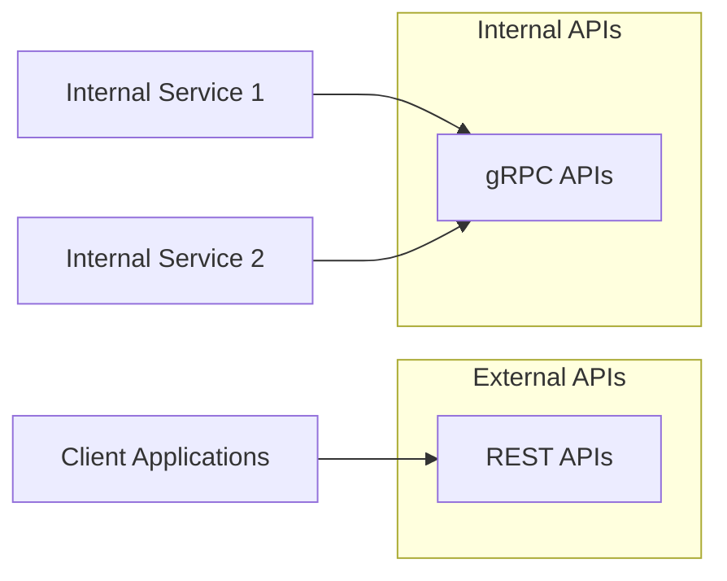

# API Reference

The Halooid platform provides a comprehensive set of APIs that allow you to interact with the platform programmatically. This reference documentation provides detailed information about the available APIs, including endpoints, request and response formats, authentication, and examples.

## API Overview

The Halooid platform offers two types of APIs:

1. **REST APIs**: HTTP-based APIs that follow REST principles, documented using OpenAPI specifications.
2. **gRPC APIs**: High-performance RPC APIs used primarily for internal service-to-service communication.



## Authentication

All API requests must be authenticated using JWT (JSON Web Tokens). To authenticate your requests:

1. Obtain a JWT token by calling the authentication endpoint with valid credentials.
2. Include the token in the `Authorization` header of your requests:
   ```
   Authorization: Bearer <your_token>
   ```

For more information about authentication, see the [Authentication Guide](../architecture/api.md#authentication).

## Rate Limiting

To ensure the stability and availability of our APIs, we implement rate limiting. The current rate limits are:

- **REST APIs**: 100 requests per minute per user
- **gRPC APIs**: 1000 requests per minute per service

If you exceed these limits, you will receive a `429 Too Many Requests` response. The response will include a `Retry-After` header indicating how long you should wait before making another request.

## Error Handling

All APIs use standard HTTP status codes to indicate the success or failure of a request. In addition, error responses include a JSON body with more detailed information:

```json
{
  "error": {
    "code": "RESOURCE_NOT_FOUND",
    "message": "The requested resource was not found",
    "details": {
      "resource_type": "Task",
      "resource_id": "123"
    }
  }
}
```

For more information about error handling, see the [Error Handling Guide](../architecture/api.md#error-handling).

## API Versioning

All APIs are versioned to ensure backward compatibility. The version is included in the URL path:

```
https://api.halooid.com/v1/tasks
```

We follow semantic versioning for our APIs:

- **Major version changes (v1, v2, etc.)**: Breaking changes that require client updates.
- **Minor version changes (v1.1, v1.2, etc.)**: Non-breaking additions or changes.
- **Patch version changes (v1.1.1, v1.1.2, etc.)**: Bug fixes and minor improvements.

## Product APIs

Each product in the Halooid platform has its own set of APIs:

### Taskake API

The Taskake API allows you to manage tasks, projects, and teams programmatically. For more information, see the [Taskake API Reference](../products/taskake/api.md).

### Qultrix API

The Qultrix API allows you to manage HR processes, including employee records, time off, and performance reviews. For more information, see the [Qultrix API Reference](../products/qultrix/api.md).

### AdminHub API

The AdminHub API allows you to monitor and administer the Halooid platform. For more information, see the [AdminHub API Reference](../products/adminhub/api.md).

### CustomerConnect API

The CustomerConnect API allows you to manage customer relationships, including contacts, opportunities, and interactions. For more information, see the [CustomerConnect API Reference](../products/customerconnect/api.md).

### Invantray API

The Invantray API allows you to manage inventory and assets. For more information, see the [Invantray API Reference](../products/invantray/api.md).

## API Specifications

### REST API

The REST API is documented using OpenAPI specifications. You can view the full specification here:

- [OpenAPI Specification](rest.md)

### gRPC API

The gRPC API is documented using Protocol Buffers. You can view the full specification here:

- [gRPC Specification](grpc.md)

## API Client Libraries

We provide client libraries for popular programming languages to make it easier to integrate with the Halooid platform:

- **Go**: [halooid-go](https://github.com/yourusername/halooid-go)
- **JavaScript/TypeScript**: [halooid-js](https://github.com/yourusername/halooid-js)
- **Python**: [halooid-python](https://github.com/yourusername/halooid-python)
- **Java**: [halooid-java](https://github.com/yourusername/halooid-java)

## API Examples

### REST API Example

```bash
# Get a list of tasks
curl -X GET \
  https://api.halooid.com/v1/tasks \
  -H 'Authorization: Bearer <your_token>' \
  -H 'Content-Type: application/json'

# Create a new task
curl -X POST \
  https://api.halooid.com/v1/tasks \
  -H 'Authorization: Bearer <your_token>' \
  -H 'Content-Type: application/json' \
  -d '{
    "title": "Complete API documentation",
    "description": "Write comprehensive API documentation for the Halooid platform",
    "due_date": "2023-12-31T23:59:59Z",
    "assignee_id": "user123",
    "project_id": "project456",
    "priority": "high"
  }'
```

### gRPC API Example

```go
// Connect to the gRPC server
conn, err := grpc.Dial("api.halooid.com:50051", grpc.WithTransportCredentials(credentials))
if err != nil {
    log.Fatalf("Failed to connect: %v", err)
}
defer conn.Close()

// Create a client
client := pb.NewTaskServiceClient(conn)

// Create a new task
task, err := client.CreateTask(context.Background(), &pb.CreateTaskRequest{
    Title: "Complete API documentation",
    Description: "Write comprehensive API documentation for the Halooid platform",
    DueDate: timestamppb.New(time.Date(2023, 12, 31, 23, 59, 59, 0, time.UTC)),
    AssigneeId: "user123",
    ProjectId: "project456",
    Priority: pb.TaskPriority_HIGH,
})
if err != nil {
    log.Fatalf("Failed to create task: %v", err)
}
log.Printf("Created task: %v", task)
```

## Next Steps

To learn more about specific APIs, check out the following pages:

- [REST API Reference](rest.md)
- [gRPC API Reference](grpc.md)
- [Product-specific API References](#product-apis)
