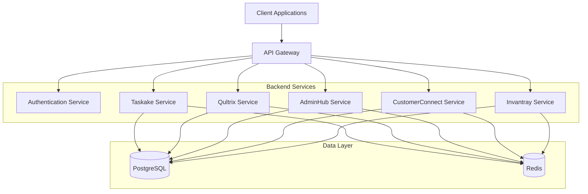
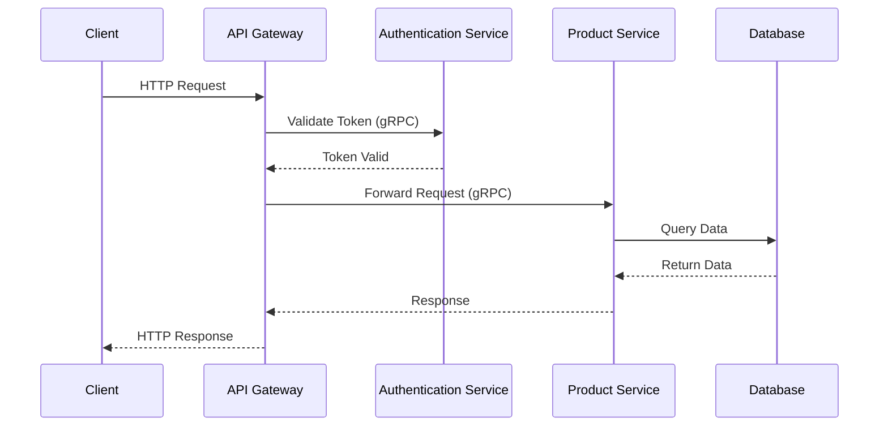
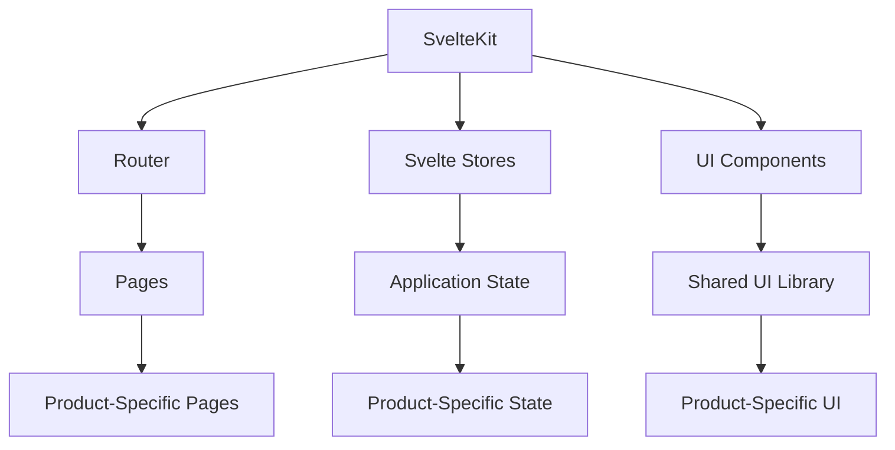
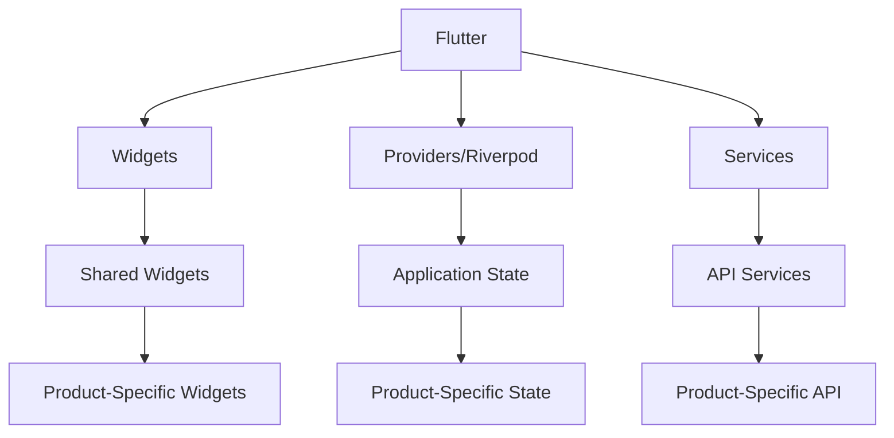
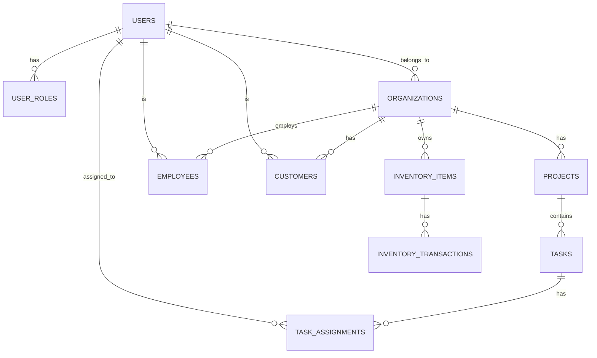
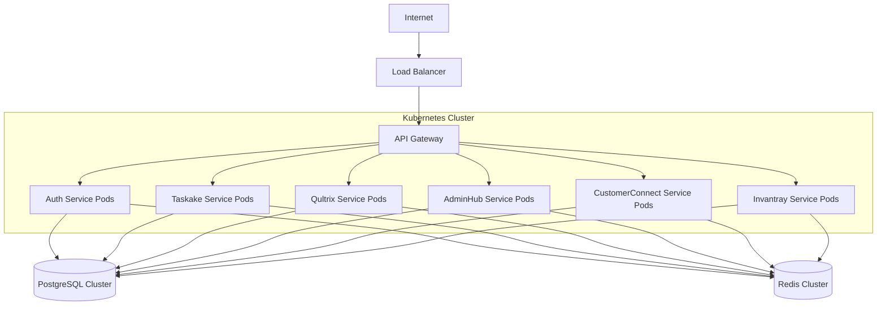

# Architecture Overview

The Halooid platform is designed with a modern, scalable architecture that enables efficient development and maintenance of multiple products within a single ecosystem. This document provides a high-level overview of the platform's architecture.

## System Architecture

The Halooid platform follows a microservices architecture pattern, with clear separation between different products while sharing common infrastructure and libraries.

## Key Components

### API Gateway

The API Gateway serves as the entry point for all client applications, handling request routing, composition, and protocol translation. It provides a unified interface for clients to interact with the various backend services.

### Authentication Service

The Authentication Service manages user authentication and authorization across all products. It implements JWT-based authentication with role-based access control to ensure secure access to resources.

### Product Services

Each product (Taskake, Qultrix, AdminHub, CustomerConnect, and Invantray) has its own dedicated service that implements the business logic specific to that product. These services are implemented in Go and expose both REST and gRPC APIs.

### Data Layer

The data layer consists of PostgreSQL for persistent storage and Redis for caching. PostgreSQL stores all application data with proper schema design for each product, while Redis improves performance by caching frequently accessed data.

## Communication Patterns

### External Communication

External clients (web and mobile applications) communicate with the backend services through REST APIs, which are documented using OpenAPI specifications. This provides a standardized, easy-to-use interface for client applications.

### Internal Communication

For internal communication between services, gRPC is used for its efficiency and strong typing. This enables high-performance, low-latency communication between backend services.

## Frontend Architecture

### Web Frontend

The web frontend is built using Svelte with SvelteKit, providing a modern, reactive user interface. Each product has its own SvelteKit application, but they share common UI components, stores, and utilities.

### Mobile Frontend

The mobile applications are built using Flutter, providing a native-like experience on both iOS and Android. The mobile apps follow a similar architecture to the web frontend, with shared components and services.

## Database Design

The database is designed to support all products while maintaining proper separation of concerns. Each product has its own schema, but common entities like users and organizations are shared across products.

## Security Architecture

Security is a fundamental aspect of the Halooid platform. The platform implements multiple layers of security:

1. **Authentication**: JWT-based authentication for all API requests
2. **Authorization**: Role-based access control for fine-grained permissions
3. **Data Encryption**: Encryption of sensitive data at rest and in transit
4. **Input Validation**: Thorough validation of all user inputs
5. **Rate Limiting**: Protection against abuse and DoS attacks
6. **Audit Logging**: Comprehensive logging of security-relevant events

## Deployment Architecture

The Halooid platform is designed to be deployed in a containerized environment using Docker and Kubernetes, enabling scalability and resilience.

## Next Steps

For more detailed information about specific aspects of the architecture, please refer to the following pages:

- [Backend Architecture](backend.md)
- [Frontend Architecture](frontend.md)
- [Mobile Architecture](mobile.md)
- [Database Design](database.md)
- [API Architecture](api.md)
