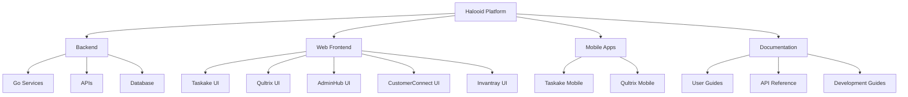

# Halooid Platform

Welcome to the official documentation for the Halooid multi-product platform. This documentation provides comprehensive information about our suite of products, architecture, development guidelines, and more.

## Project Overview

Halooid is a multi-product platform consisting of five integrated products:

- :material-checkbox-marked-circle-outline: __Taskake__: Task management system
- :material-account-group: __Qultrix__: Human Resource Management Software
- :material-view-dashboard: __AdminHub__: Internal monitoring and administration
- :material-account-supervisor-circle: __CustomerConnect__: CRM for customer interactions
- :material-package-variant-closed: __Invantray__: Inventory and asset management software

## Technical Architecture

The Halooid platform is built using modern technologies and follows best practices for scalable, maintainable software development.

### Backend

- **Language**: Go
- **API Approach**: Hybrid (REST with OpenAPI + gRPC for internal communication)
- **Database**: PostgreSQL with Redis for caching
- **Authentication**: JWT-based with role-based access control

### Web Frontend

- **Framework**: Svelte with SvelteKit
- **Styling**: Tailwind CSS
- **State Management**: Svelte stores
- **Build System**: Vite

### Mobile

- **Framework**: Flutter
- **State Management**: Provider/Riverpod
- **API Communication**: Dio

## Project Structure

The project follows a monorepo approach with clear separation between backend, web, and mobile applications, while sharing common libraries and components.

## Getting Started

To get started with the Halooid platform, check out the following resources:

- [Installation Guide](getting-started/installation.md)
- [Quick Start Guide](getting-started/quick-start.md)
- [Architecture Overview](architecture/index.md)
- [Development Setup](development/setup.md)

## Products

Learn more about each of our products:

- [Taskake](products/taskake/index.md) - Task management system
- [Qultrix](products/qultrix/index.md) - Human Resource Management Software
- [AdminHub](products/adminhub/index.md) - Internal monitoring and administration
- [CustomerConnect](products/customerconnect/index.md) - CRM for customer interactions
- [Invantray](products/invantray/index.md) - Inventory and asset management software

## Contributing

We welcome contributions to the Halooid platform! Please check out our [Contributing Guidelines](contributing/index.md) to get started.
