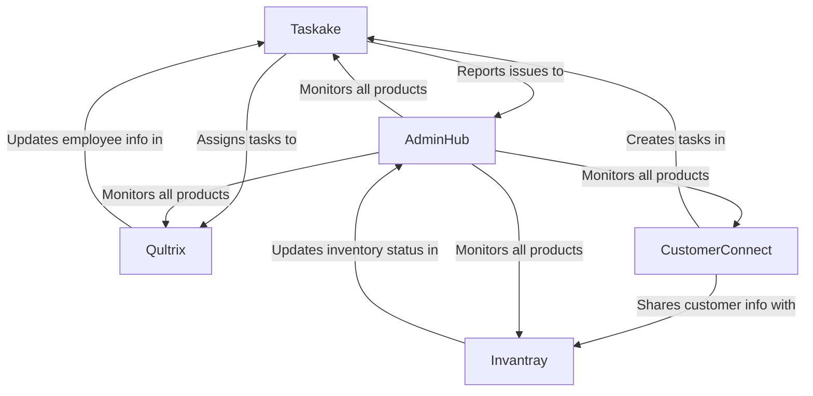

# Products Overview

The Halooid platform consists of five integrated products, each designed to address specific business needs while working together as a cohesive ecosystem.

## Product Suite

-   :material-checkbox-marked-circle-outline: __Taskake__

    ---

    A comprehensive task management system designed to help teams organize, track, and complete work efficiently.
    
    [:octicons-arrow-right-24: Learn more](taskake/index.md)

-   :material-account-group: __Qultrix__

    ---

    A Human Resource Management Software that streamlines HR processes, from recruitment to performance management.
    
    [:octicons-arrow-right-24: Learn more](qultrix/index.md)

-   :material-view-dashboard: __AdminHub__

    ---

    An internal monitoring and administration tool that provides insights and control over the entire platform.
    
    [:octicons-arrow-right-24: Learn more](adminhub/index.md)

-   :material-account-supervisor-circle: __CustomerConnect__

    ---

    A Customer Relationship Management System (CRM) for managing customer interactions and relationships.
    
    [:octicons-arrow-right-24: Learn more](customerconnect/index.md)

-   :material-package-variant-closed: __Invantray__

    ---

    An inventory and asset management software for tracking and managing physical and digital assets.
    
    [:octicons-arrow-right-24: Learn more](invantray/index.md)

## Integration Philosophy

While each product in the Halooid platform can function independently, they are designed to work together seamlessly, providing additional value through integration. This integration is achieved through:

1. **Shared User Management**: Users can access all products with a single account, with appropriate permissions.
2. **Cross-Product Workflows**: Actions in one product can trigger workflows in another.
3. **Unified Data Model**: Common entities like users, organizations, and projects are shared across products.
4. **Consistent User Experience**: All products follow the same design principles and interaction patterns.

## Integration Examples

Here are some examples of how the products integrate with each other:

### Taskake + Qultrix
- Tasks can be assigned based on employee skills and availability
- Employee performance can be tracked through task completion metrics

### Taskake + CustomerConnect
- Customer requests can automatically create tasks
- Task updates can be communicated to customers

### Invantray + CustomerConnect
- Product availability can be checked during customer interactions
- Customer orders can update inventory levels

### AdminHub + All Products
- Centralized monitoring of all platform activities
- Cross-product reporting and analytics

## Product Roadmaps

Each product has its own development roadmap, but they are coordinated to ensure that the platform evolves cohesively. For more information about the roadmap for each product, please visit the respective product pages:

- [Taskake Roadmap](taskake/index.md#roadmap)
- [Qultrix Roadmap](qultrix/index.md#roadmap)
- [AdminHub Roadmap](adminhub/index.md#roadmap)
- [CustomerConnect Roadmap](customerconnect/index.md#roadmap)
- [Invantray Roadmap](invantray/index.md#roadmap)

## Next Steps

To learn more about each product, click on the links above or navigate to the product-specific sections in the sidebar.
