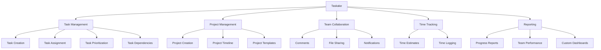

# Taskake

Taskake is a comprehensive task management system designed to help teams organize, track, and complete work efficiently.

## Overview

Taskake provides a flexible and intuitive platform for managing tasks and projects. It allows teams to create, assign, and track tasks, set priorities and deadlines, and collaborate effectively.

## Key Features

### Task Management

- **Task Creation and Assignment**: Create tasks with detailed descriptions, assign them to team members, and set due dates.
- **Task Prioritization**: Set priorities for tasks to ensure the most important work gets done first.
- **Task Dependencies**: Define dependencies between tasks to ensure they are completed in the right order.
- **Task Status Tracking**: Track the status of tasks through customizable workflows.

### Project Management

- **Project Creation**: Organize tasks into projects with clear goals and timelines.
- **Project Templates**: Create templates for recurring projects to save time.
- **Project Timeline**: Visualize project timelines with Gantt charts.
- **Project Dashboards**: Get a quick overview of project status and progress.

### Team Collaboration

- **Comments and Discussions**: Discuss tasks and projects with team members.
- **File Sharing**: Attach files to tasks and projects for easy reference.
- **Notifications**: Stay informed about task updates and mentions.
- **Activity Feed**: See a chronological feed of all activity in your projects.

### Time Tracking

- **Time Estimates**: Set time estimates for tasks to help with planning.
- **Time Logging**: Log time spent on tasks for accurate reporting.
- **Time Reports**: Generate reports on time spent by team members, projects, or tasks.

### Reporting and Analytics

- **Progress Reports**: Track progress against goals and deadlines.
- **Team Performance**: Analyze team performance and workload.
- **Custom Dashboards**: Create custom dashboards to visualize the metrics that matter to you.

## Use Cases

Taskake is designed to be flexible and can be used for a variety of use cases:

- **Software Development**: Track features, bugs, and sprints.
- **Marketing Campaigns**: Plan and execute marketing campaigns.
- **Product Launches**: Coordinate all aspects of a product launch.
- **Client Projects**: Manage client projects and deliverables.
- **Personal Task Management**: Organize personal tasks and to-dos.

## Integration with Other Products

Taskake integrates with other products in the Halooid platform:

- **Qultrix**: Tasks can be assigned based on employee skills and availability.
- **AdminHub**: Administrators can monitor task and project status across the organization.
- **CustomerConnect**: Customer requests can automatically create tasks.
- **Invantray**: Tasks can be linked to inventory items for maintenance or deployment.

## Getting Started

To get started with Taskake, check out the following resources:

- [Features](features.md): Detailed information about Taskake features.
- [API](api.md): Documentation for the Taskake API.
- [User Guide](user-guide.md): A comprehensive guide to using Taskake.

## Roadmap

The Taskake roadmap includes the following upcoming features:

- **Advanced Reporting**: More detailed and customizable reports.
- **Resource Management**: Better tools for managing team resources and capacity.
- **AI-Powered Task Suggestions**: Intelligent suggestions for task assignments and priorities.
- **Mobile App Enhancements**: Improved mobile experience with offline capabilities.
- **Integration with External Tools**: Connect with popular tools like Slack, GitHub, and more.
